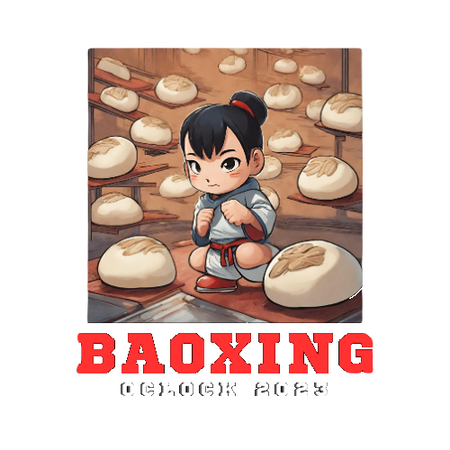
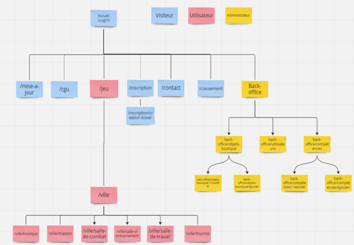
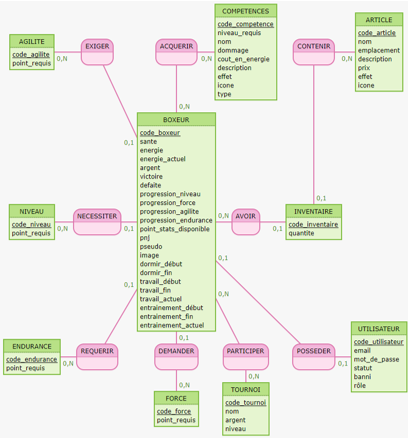
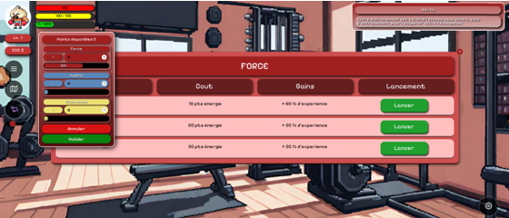

# Baoxer

Projet de fin d'étude O'clock lors de ma formation Développeur Web du 07/23 au 12/23.

[Présentation Youtube](https://www.youtube.com/watch?v=ipFrNFLpNy0)

Projet réalisé sur une période de 1 mois soit 4 sprint d'une semaine avec une équipe de 5 personnes :
FrontEnd
- [Mickael Dahan](https://www.linkedin.com/in/mickael-dahan-6008422a6/)
- [Jiovani Vianey](https://www.linkedin.com/in/jiovani-vianey/)
- [Eleonore Tranchard](https://www.linkedin.com/in/eleonore-tranchard-107b6b288/)

BackEnd
- [Cédric Jeanne-Rose](https://www.linkedin.com/in/c%C3%A9dric-jeanne-rose-a18497143/)
- [Moi même](https://www.linkedin.com/in/florent-bouysse/)

## Sprint 0 : Conception

Création du cahier des charges, évaluation des contraintes et difficultés pouvant être rencontré, définition d'un MVP. Création de l'arborescence de l'application, des wireframes ainsi que modélisation de la base de données via Mocodo.

## Sprint 1 : Composants et API

Côté Front, on commence à créer les premier composant en React et les premières pages pour les visiteurs de l'application.

Côté Back, on crée la base de données, les fixtures et on crée les premières routes API pour la connexion avec le Front.

## Sprint 2 : Dynamisme et connexion

Côté Front, il faut dynamiser le tout, designer l'application et faire le responsive pour les utilisateurs mobile mais aussi comprendre comment gérer les combats entre un utilisateur et une IA. 

Côté Back, le gros des routes API doit être terminés, il nous faut mettre en ligne l'API pour que le Front utilise les données de la base de données. Mises en place d'un Token JWT, des rôles et du hachage de mot de passe pour les sécurités de l'applications.

## Sprint 3 : Finition et autres

Côté Front, peaufinage du style visuel, création d'image via DALL-E, mises en place de la musique du jeu et corrections de bugs. 

Côté Back, Création et mises en place d'un mail de confirmation d'inscription, finition du back office et vérification du fonctionnement de l'application en général et du bon transite des données. 

## Screen de l'application

